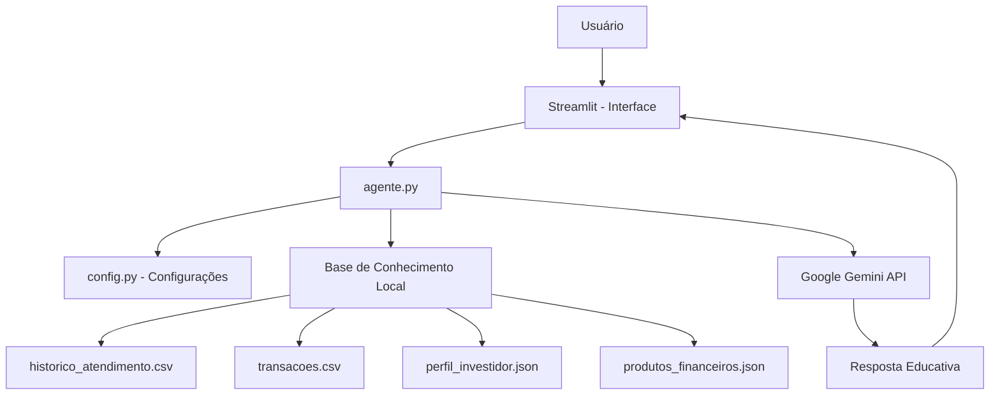

# 🎓 EDU — Educador Financeiro Inteligente

> Agente de IA Generativa que ensina conceitos de finanças pessoais de forma simples e personalizada, usando os próprios dados do cliente como exemplos práticos.

## 💡 O Que é o EDU?

O EDU é um educador financeiro que **ensina**, não recomenda. Ele explica conceitos como reserva de emergência, tipos de investimentos e análise de gastos usando uma abordagem didática e exemplos concretos baseados no perfil do cliente.

**O que o EDU faz:**
- ✅ Explica conceitos financeiros de forma simples e acessível
- ✅ Usa os dados reais do cliente como exemplos práticos
- ✅ Responde dúvidas sobre produtos financeiros disponíveis
- ✅ Analisa padrões de gastos de forma educativa
- ✅ Mantém histórico de conversa para um atendimento mais contextual

**O que o EDU NÃO faz:**
- ❌ Não recomenda investimentos específicos
- ❌ Não acessa dados bancários sensíveis
- ❌ Não substitui um profissional certificado (CFP, CGA, etc.)

---

## ⚙️ Decisão Técnica — Por que saímos do Ollama?

A versão original deste projeto utilizava o **Ollama** com um modelo local (`gpt-oss`) para processar as perguntas do usuário. Durante o desenvolvimento, identificamos uma limitação prática: o notebook utilizado não possuía memória RAM suficiente para rodar modelos locais com desempenho aceitável, tornando a experiência lenta e instável.

Por esse motivo, migramos para a **API do Google Gemini** via a biblioteca oficial `google-genai`, mantendo a mesma proposta educativa do agente, mas com uma infraestrutura mais leve e acessível para o hardware disponível.

| | Ollama (versão anterior) | Google Gemini (versão atual) |
|---|---|---|
| Execução | Local (requer hardware) | Nuvem (via API) |
| Requisito de RAM | 8GB+ recomendado | Nenhum |
| Custo | Gratuito | Gratuito (com limites) |
| Configuração | Complexa | Simples (só a API key) |
| Modelo usado | `gpt-oss` local | `gemini-2.0-flash-lite` |

---

## 🏗️ Arquitetura Atual



**Stack atual:**
- Interface: Streamlit
- LLM: Google Gemini (`gemini-2.0-flash-lite`) via `google-genai`
- Base de conhecimento: arquivos JSON e CSV mockados
- Configuração: variáveis de ambiente via `.env`

---

## 📁 Estrutura do Projeto

```
dio-lab-bia-do-futuro/
│
├── data/                           # Base de conhecimento
│   ├── perfil_investidor.json      # Perfil do cliente
│   ├── perfil_investidor.txt       # Versão convertida para NotebookLM
│   ├── transacoes.csv              # Histórico financeiro
│   ├── historico_atendimento.csv   # Interações anteriores
│   ├── produtos_financeiros.json   # Produtos para ensino
│   └── produtos_financeiros.txt    # Versão convertida para NotebookLM
│
├── docs/                           # Documentação completa
│   ├── 01-documentacao-agente.md   # Caso de uso e persona
│   ├── 02-base-conhecimento.md     # Estratégia de dados
│   ├── 03-prompts.md               # System prompt e exemplos
│   ├── 04-metricas.md              # Avaliação de qualidade
│   └── 05-pitch.md                 # Apresentação do projeto
│
├── src/
│   ├── app.py                      # Interface Streamlit
│   ├── agente.py                   # Lógica do agente e integração Gemini
│   ├── config.py                   # Configurações e persona do EDU
│   └── converter.py                # Converte JSON para TXT (uso único)
│
├── .env.example                    # Modelo de configuração (sem dados sensíveis)
├── .gitignore                      # Protege .env e venv
├── requirements.txt                # Dependências do projeto
└── README.md
```

---

## 🚀 Como Executar

### 1. Clonar o repositório

```bash
git clone https://github.com/ricardho/dio-lab-bia-do-futuro.git
cd dio-lab-bia-do-futuro
```

### 2. Criar e ativar o ambiente virtual

```bash
python -m venv venv

# Mac/Linux
source venv/bin/activate

# Windows
venv\Scripts\activate
```

### 3. Instalar as dependências

```bash
pip install -r requirements.txt
```

### 4. Configurar a API Key do Gemini

Crie um arquivo `.env` na raiz do projeto:

```env
GEMINI_API_KEY=sua-chave-aqui
```

> Obtenha sua chave gratuita em: [aistudio.google.com/apikey](https://aistudio.google.com/apikey)

### 5. Rodar o EDU

```bash
streamlit run src/app.py
```

Acesse no navegador: `http://localhost:8501`

---

## 🎯 Exemplo de Uso

**Pergunta:** "O que é CDI?"
**EDU:** "CDI é uma taxa de referência usada pelos bancos. Quando um investimento rende '100% do CDI', significa que ele acompanha essa taxa. Hoje o CDI está próximo da Selic. Quer que eu explique a diferença entre os dois?"

**Pergunta:** "Onde estou gastando mais?"
**EDU:** "Olhando suas transações, sua maior despesa é moradia, seguida de alimentação. Juntas, representam quase 80% dos seus gastos. Isso é bem comum! Quer que eu explique algumas estratégias de organização?"

---

## 📊 Métricas de Avaliação

| Métrica | Objetivo |
|---|---|
| **Assertividade** | O agente responde o que foi perguntado? |
| **Segurança** | Evita inventar informações (anti-alucinação)? |
| **Coerência** | A resposta é adequada ao perfil do cliente? |
| **Didatismo** | A linguagem é acessível para leigos em finanças? |

---

## 🗺️ Próximos Passos

Este projeto foi entregue dentro do prazo do bootcamp DIO com a migração do Ollama para o Gemini já implementada. As evoluções planejadas para as próximas versões são:

- [ ] Reformular o conceito do agente com base nas novas capacidades do Gemini
- [ ] Integrar o NotebookLM como repositório de conhecimento adicional
- [ ] Adicionar suporte a perguntas por voz (Speech-to-Text)
- [ ] Implementar memória persistente entre sessões
- [ ] Criar testes automatizados para validar as respostas do EDU
- [ ] Melhorar a interface com gráficos das transações do cliente

---

## 🎬 Diferenciais

- **Personalização:** Usa os dados do próprio cliente nos exemplos
- **Leve:** Roda via API do Gemini, sem necessidade de hardware potente
- **Educativo:** Foco em ensinar, não em vender produtos financeiros
- **Seguro:** Chaves de API protegidas via `.env` e `.gitignore`
- **Arquitetura modular:** Fácil de evoluir e trocar componentes

---

## 📝 Documentação Completa

Toda a documentação técnica, estratégias de prompt e casos de teste estão disponíveis na pasta [`docs/`](./docs/).

---

> Projeto desenvolvido como parte do **Bootcamp DIO** — entregue dentro do prazo com adaptações técnicas necessárias para viabilizar a execução no hardware disponível. Melhorias conceituais e funcionais serão implementadas nas próximas versões. 🚀